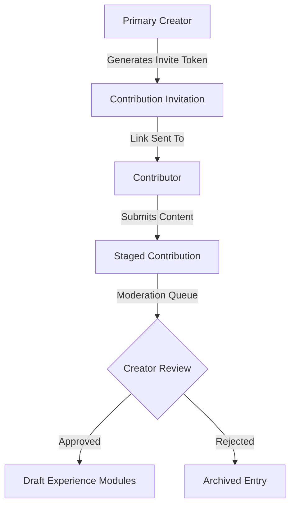
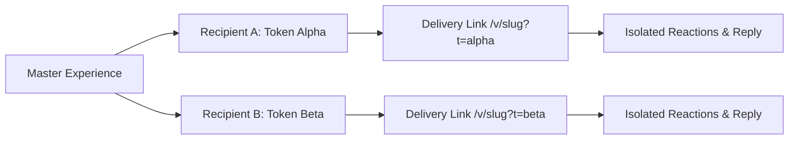

# Phase 5B Architecture Groundwork: Contributions & Multi-Recipient Delivery

> **Status:** Groundwork & Specification (Phase 5B P2 — Strictly Non-User-Facing)  
> **Target Release:** Phase 5C / Future Releases  
> **Author:** Valentino Core Engineering Team  

---

## 1. Executive Summary

This document establishes the system architecture and database design for two upcoming extensions to the Valentino experience platform:
1. **Collaborative Experience Contributions:** Enabling multiple creators (friends, family members, bridesmaids/groomsmen) to contribute photos, letters, voice notes, and memories into a unified experience without creator account sharing.
2. **Multiple-Recipient Delivery Architecture:** Allowing a single master experience to be dispatched to multiple recipients with individualized delivery links, personalized salutations, isolated reactions/replies, and granular delivery tracking.

In accordance with Phase 5B execution rules, this groundwork is non-user-facing. No premature user interfaces or mock endpoints are exposed to creators or recipients.

---

## 2. Contribution Architecture

### 2.1 Motivation & Scope
In group Valentine cards, anniversary gifts, or farewell dedications, a primary creator orchestrates the gift while inviting peers to add their own memories. 

### 2.2 Domain Model & Permissions


#### Proposed Prisma Schema Extensions
```prisma
enum ContributorRole {
  CONTRIBUTOR_MEDIA_ONLY
  CONTRIBUTOR_FULL
}

enum ContributionStatus {
  PENDING_REVIEW
  APPROVED
  REJECTED
  MERGED
}

model ExperienceContributorInvite {
  id            String          @id @default(cuid())
  experienceId  String
  tokenHash     String          @unique // SHA-256 of invite secret
  role          ContributorRole @default(CONTRIBUTOR_MEDIA_ONLY)
  maxUses       Int             @default(1)
  useCount      Int             @default(0)
  expiresAt     DateTime
  createdBy     String          // Session userId
  createdAt     DateTime        @default(now())

  experience    Experience      @relation(fields: [experienceId], references: [id], onDelete: Cascade)
  contributions ExperienceContribution[]

  @@index([experienceId])
}

model ExperienceContribution {
  id              String             @id @default(cuid())
  experienceId    String
  inviteId        String?
  contributorName String
  contributorEmail String?
  contentType     String             // 'memory' | 'voice_note' | 'letter_paragraph'
  stagedPayload   Json               // Structured payload matching module format
  mediaId         String?            // Refers to ExperienceMedia
  status          ContributionStatus @default(PENDING_REVIEW)
  reviewedAt      DateTime?
  reviewedBy      String?
  createdAt       DateTime           @default(now())

  experience      Experience         @relation(fields: [experienceId], references: [id], onDelete: Cascade)
  invite          ExperienceContributorInvite? @relation(fields: [inviteId], references: [id], onDelete: SetNull)
  media           ExperienceMedia?   @relation(fields: [mediaId], references: [id], onDelete: SetNull)

  @@index([experienceId, status])
}
```

### 2.3 Security & Moderation Flow
1. **Cryptographic Tokens:** Invite tokens are generated using `crypto.randomBytes(32).toString('hex')`. The raw token is sent to the collaborator; only the salted SHA-256 digest is stored in the database.
2. **Quota & Rate Limiting:** Each invite token is capped by `maxUses` and an IP-based rate limiter to prevent flooding.
3. **Staging Isolation:** Contributed media and text are stored in `ExperienceContribution` with status `PENDING_REVIEW`. They **never** directly mutate `Experience.draftConfig` or `Experience.publishedConfig`.
4. **Creator Moderation Queue:** The creator approves each submission. Upon approval, the server transposes the staged payload into the appropriate module entry in `draftConfig`.

---

## 3. Multiple-Recipient Delivery Architecture

### 3.1 Motivation & Scope
Currently, an experience has one `publicId` with uniform recipient access. For scenarios such as:
- Sending a Valentine to multiple family members or close friends
- Distributing a wedding party thank-you experience
- Individualized delivery timestamps across different timezones

### 3.2 Domain Model & Schema Design


#### Proposed Prisma Schema Extensions
```prisma
model ExperienceRecipient {
  id             String          @id @default(cuid())
  experienceId   String
  recipientName  String
  recipientEmail String?
  recipientPhone String?
  tokenHash      String          @unique // SHA-256 of delivery token
  
  // Per-recipient delivery overrides
  customSalutation String?
  customGreeting   String?
  scheduledUnlockAt DateTime?    // Timezone-adjusted scheduled unlock
  
  // Delivery telemetry
  deliveredAt    DateTime?
  firstOpenedAt  DateTime?
  lastOpenedAt   DateTime?
  openCount      Int             @default(0)
  secretUnlocked Boolean         @default(false)
  
  createdAt      DateTime        @default(now())
  updatedAt      DateTime        @updatedAt

  experience     Experience      @relation(fields: [experienceId], references: [id], onDelete: Cascade)
  reactions      ExperienceReaction[]
  replies        ExperienceReply[]

  @@index([experienceId])
}
```

### 3.3 Link Resolution & Personalization
1. **Public Route Resolution:** `/v/[publicId]?t=[token]`
2. **Token Verification:**
   - The server queries `ExperienceRecipient` by the SHA-256 hash of `t`.
   - If valid, the server injects the recipient's custom salutation into the template render stream.
   - If omitted or invalid, the experience falls back to default master `publishedConfig` values.
3. **Isolated Interactions:**
   - When submitting reactions or replies, the client passes `t`. The server correlates the reaction to `recipientId`, allowing the creator to view which recipient sent which heart, sparkle, or heartfelt confession.
4. **Timezone-Aware Scheduled Reveal:**
   - Each recipient can have their own `scheduledUnlockAt`, allowing midnight reveals in their local timezone.

---

## 4. Phase 5C Migration Roadmap

| Milestone | Deliverables | Target Phase |
| :--- | :--- | :--- |
| **Stage 1: Contributor API** | DB migrations, invite token generation API, collaborator upload endpoints | Phase 5C.1 |
| **Stage 2: Creator Moderation Studio** | Studio 2.0 Review Drawer, inline approve/reject preview | Phase 5C.2 |
| **Stage 3: Multi-Recipient Dispatch** | Batch recipient list management, CSV import, individualized QR generation | Phase 5C.3 |
| **Stage 4: Recipient Analytics** | Per-recipient telemetry dashboard, delivery status receipts | Phase 5C.4 |

---
*End of Groundwork Specification.*
